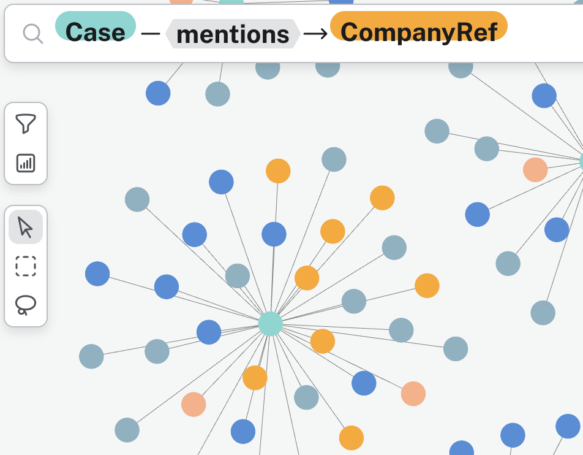

## Bartlebot


Bartlebot is a demonstration of an AI Agent for the legal domain with a Slack integration.
It is in early development.

See the [Bartlebot repository](https://github.com/The-AI-Alliance/bartlebot) on GitHub.

[](https://github.com/The-AI-Alliance/bartlebot/actions/workflows/pytest.yml)
[](https://github.com/The-AI-Alliance/bartlebot/tree/main?tab=Apache-2.0-1-ov-file#readme)
[](https://github.com/The-AI-Alliance/bartlebot/issues)
[](https://github.com/The-AI-Alliance/bartlebot/stargazers)

<br clear="left"/>

## Quickstart

### Bartlebot Installation

```bash
git clone git@github.com:The-AI-Alliance/bartlebot.git
python -m venv venv
. venv/bin/activate
python -m pip install .
```

### Configuration

In the root of the repository is a default `bartlebot.yml` file.

### Inference

Bartlebot is configured to use Llama 4 models hosted by [Together.AI](https://www.together.ai/) by default.
Any provider supported by [AI Suite](https://github.com/andrewyng/aisuite/) will work.

To use inference on Together.AI, you will need to obtain and set the `TOGETHER_API_KEY`.
New accounts come with a small amount of free credit to get started.

To use another provider, change the model id strings.

### Knowledge Graph

Bartlebot is configured to use a Neo4j graph database.
Neo4j provides [free sandbox](https://neo4j.com/sandbox/) instances.

The URI goes in `graph.neo4j_uri` in `bartlebot.yml`

Set the values for `NEO4J_USERNAME` and `NEO4J_PASSWORD` as either environment variables
or in the `graph` section of the configuraiton file (lower-cased).

### Slack

Bartlebot is currently implemented as a Slack application.  It needs to have the environment varaibles `SLACK_BOT_TOKEN` and `SLACK_APP_TOKEN` set.
See the [Proscenium Slack setup](https://github.com/The-AI-Alliance/proscenium/blob/main/docs/slack-app-setup.md) document.

You will also need to set the id of the admin channel as `SLACK_ADMIN_CHANNEL_ID`.
If you don't happen to know this, run barblebot in verbose mode to see the list of
channel ids subscribed to by Proscenium.

### Building Data Dependencies

The vectors and knowledge graph derived from case law the first time Bartlebot runs.

```bash
bartlebot --verbose
```

### Running Bartlebot

```bash
bartlebot --verbose
```

## Case Law Research

Bartlebot implements question-answering related to
large, public-domain legal datasets including U.S. case law.


The questions chosen highlight categories of questions where the ability to traverse a
Knowledge Graph provides advantages over a naive RAG approach.



## Benchmarks

Existing legal benchmarks today are very narrow and/or do not map well to customer value.

Bartlebot will demonstrate creating and monitoring domain-specific benchmarks.

## Resources

To find the Bartlebot community, see the [discussions](https://github.com/The-AI-Alliance/bartlebot/discussions)

Bartlebot is built with Proscenium ([site](https://the-ai-alliance.github.io/proscenium/), [repo](https://github.com/The-AI-Alliance/proscenium) )
