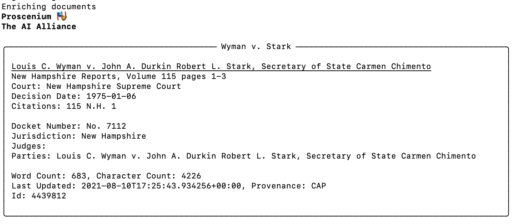

## Bartlebot

Bartlebot is a demonstration of an AI Agent for the legal domain with a Slack integration.  It is based on [Proscenium](https://the-ai-alliance.github.io/proscenium/), [repo](https://github.com/The-AI-Alliance/proscenium)

 

See the [Bartlebot repository](https://github.com/The-AI-Alliance/bartlebot) on GitHub.

## Quickstart

To Be Written

## Resources

To find the Bartlebot community, see the [discussions](https://github.com/The-AI-Alliance/bartlebot/discussions)

## Federal Caselaw and Statute Research

Bartlebot implements question-answering related to
large, public-domain legal datasets including U.S. federal case law and statutes.

The questions chosen highlight categories of questions where the ability to traverse a
Knowledge Graph provides advantages over a naive RAG approach.

## Requirements

- Bartlebot is currently implemented as a Slack application.
- It uses Llama 4 models hosted by Together.AI
- It makes use of a Neo4j graph database

It will also demonstrate the creation and tuning of custom benchmarks.

Existing legal benchmarks today are very narrow and/or do not map well to customer value.
